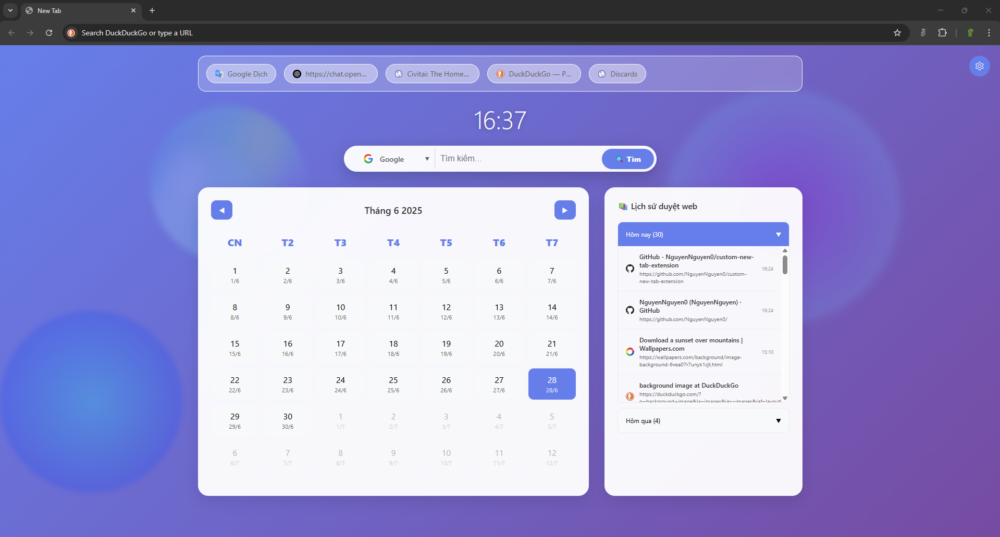

# New Tab Override Extension

This project is a custom browser extension designed to override the default new tab page with a personalized interface. The extension includes features such as:

- A calendar view for quick date reference.
- A search bar for convenient web searches.
- A browsing history section for easy access to recently visited websites.

## Features

- **Custom Calendar**: Displays the current month and allows navigation between months.
- **Search Bar**: Integrated search functionality with support for popular search engines.
- **Browsing History**: Displays a list of recently visited websites for quick access.

## Demo

Below is a screenshot of the custom new tab page:

## Installation

1. Clone this repository to your local machine.
2. Open your browser's extension settings.
3. Enable "Developer Mode."
4. Load the unpacked extension from the cloned directory.

## Usage

Once installed, open a new tab in your browser to see the custom interface. Use the calendar, search bar, and browsing history features to enhance your browsing experience.

